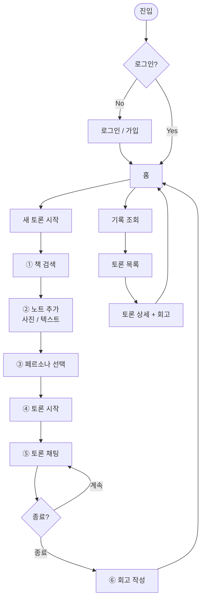

# User Flow

> 책담의 화면·기능 간 사용자 여정. 핵심 시나리오 + 보조 흐름.

---

## 1. 메인 흐름 (첫 사용자)

```
[랜딩 / 진입]
   │
   ├─ 미로그인 → [로그인 / 가입]
   │              │
   │              └─ 가입 (이메일 + 닉네임) → 로그인 → ↓
   │
   └─ 로그인 ↓

[홈]
   ├─ "새 토론 시작" → ① 책 검색
   ├─ "내 토론 기록"  → ⑦ 기록 조회
   └─ "내 회고 모음"  → ⑦ 기록 조회 (회고 탭)

① [책 검색] (US-2)
   │   검색어 입력 → 결과 목록 → 책 선택
   │
   ↓
② [책 상세 / 노트 추가] (US-3, US-4)
   │   - 사진 업로드 (Vision OCR 으로 텍스트 추출)
   │   - 또는 텍스트 직접 입력
   │   - 노트 1~3개까지 누적 가능
   │
   ↓
③ [페르소나 선택] (US-5)
   │   학구파(기본) / 캐주얼 / 비평가 / ...
   │
   ↓
④ [토론 시작 버튼]
   │   Discussion.start(book, notes, persona, user)
   │   첫 AI 메시지 자동 생성
   │
   ↓
⑤ [토론 채팅] (US-7)
   │   사용자 ↔ AI 메시지 (스트리밍)
   │   "토론 종료" 버튼 노출
   │
   ↓
⑥ [토론 종료 / 회고 작성] (US-8, US-9)
   │   - 종료 확인
   │   - 회고 작성 폼 (스킵 가능)
   │   - 옵션: 기분 / 태그
   │
   ↓
[홈으로 복귀] 또는 [새 토론]
```

---

## 2. Mermaid 다이어그램 (전체 여정)



---

## 3. 보조 흐름

### 3-1. 기존 토론 재진입

```
[홈] → [내 토론 기록] → [토론 목록]
                            │
                            ├─ 진행 중(ACTIVE) 토론 → ⑤ 채팅 재진입
                            └─ 완료(COMPLETED) → ⑦ 토론 상세 + 회고 보기
```

### 3-2. 회고 수정

```
[토론 상세] → [회고 영역]
                │
                ├─ 회고 없음 → "회고 작성" 버튼 → ⑥
                └─ 회고 있음 → "수정" 버튼 → 회고 편집 → 저장
```

### 3-3. 기존 노트로 다른 토론 시작

```
[책 상세] → [기존 노트 목록] → [노트 1~3개 선택] → [페르소나 선택] → ④ 토론 시작
```

---

## 4. 화면 구조 요약 (text wireframe)

### 홈

```
┌──────────────────────────────────────┐
│  책담                            👤  │
├──────────────────────────────────────┤
│                                      │
│  📖 새 토론 시작                       │
│                                      │
│  📝 내 토론 기록                       │
│                                      │
│  💭 내 회고 모음                       │
│                                      │
└──────────────────────────────────────┘
```

### 책 검색 (모바일 우선)

```
┌──────────────────────────────────────┐
│  ← 책 검색                            │
├──────────────────────────────────────┤
│  [검색어 입력 _____________ 🔍]       │
│                                      │
│  📕 데미안                            │
│      헤르만 헤세 · 소설                  │
│  ───────────────────────────────       │
│  📗 싯다르타                           │
│      헤르만 헤세 · 소설                  │
└──────────────────────────────────────┘
```

### 노트 추가

```
┌──────────────────────────────────────┐
│  ← 데미안 · 노트 추가                   │
├──────────────────────────────────────┤
│  [📷 사진으로]   [📝 직접 입력]        │
│                                      │
│  추가된 노트 (1/3)                     │
│  ┌────────────────────────────────┐  │
│  │ "새는 알을 깨고 나오려고..."    │  │
│  └────────────────────────────────┘  │
│                                      │
│  [+ 노트 더 추가]   [다음 →]          │
└──────────────────────────────────────┘
```

### 페르소나 선택

```
┌──────────────────────────────────────┐
│  ← 페르소나 선택                       │
├──────────────────────────────────────┤
│  ⦿ 학구파 독서 친구                    │
│    "진지하게 함께 사색해요"             │
│                                      │
│  ◯ 캐주얼한 친구                       │
│    "가볍게 감상 나눠요"                 │
│                                      │
│  ◯ 비평가                             │
│    "다른 시각으로 다시 봐요"            │
│                                      │
│  [토론 시작 →]                        │
└──────────────────────────────────────┘
```

### 토론 채팅

```
┌──────────────────────────────────────┐
│  ← 데미안 · 학구파                  ⋯ │
├──────────────────────────────────────┤
│  📌 노트: "새는 알을 깨고..."          │
│                                      │
│  AI: 그 구절은 자아의 탄생을 상징해요... │
│                                      │
│              사용자: 저는 그게 두려움... │
│                                      │
│  AI: 두려움에서 시작되는 변화는...      │
│                                      │
├──────────────────────────────────────┤
│  [메시지 입력 _____________  📤]      │
│  [토론 종료]                          │
└──────────────────────────────────────┘
```

### 회고 작성

```
┌──────────────────────────────────────┐
│  ← 회고 쓰기                          │
├──────────────────────────────────────┤
│  토론을 마치며 떠오른 생각·정리:         │
│  ┌────────────────────────────────┐  │
│  │                                │  │
│  │                                │  │
│  └────────────────────────────────┘  │
│                                      │
│  기분: ⦿ 😊  ◯ 😐  ◯ 😔             │
│                                      │
│  태그(선택): #자아 #변화                │
│                                      │
│  [건너뛰기]   [저장 →]                │
└──────────────────────────────────────┘
```

---

## 5. 핵심 결정 / 디자인 노트

- **모바일 우선**: 사진 캡처는 모바일에서 자주 발생 → 모바일 화면을 기준으로 설계
- **단일 흐름 우선**: 핵심 6단계(① ~ ⑥)를 직선적으로 구성. 옆길은 진입점에서만 분기.
- **회고 스킵 허용**: 강제하면 부담. 다만 다음 진입 시 "마지막 토론에 회고를 남기시겠어요?" 안내 가능 (P2 검토)
- **종료 = COMPLETED**, 24시간 무응답 = ABANDONED 자동 (백그라운드 작업으로 처리)

---

## 6. 다음 단계

- [`features/`](./features/) — 각 단계별 입출력·예외·상태
- [`data-model.md`](./data-model.md) — 흐름이 만드는 데이터 (Discussion, ReadingNote, Reflection)
